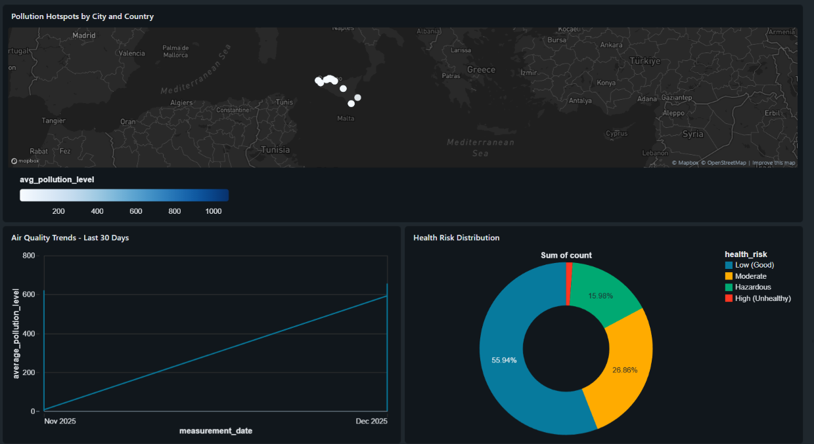

# Lakehouse AI Analytics: Predictive Air Quality Platform 

<p align="center">
  
  
  
</p>

## 📖 Overview


**Lakehouse AI Analytics** is an **end-to-end data and AI platform** designed to ingest, process, and analyze environmental data at scale. By leveraging the **Medallion Architecture** on Databricks, it transforms raw sensor data into actionable insights.

The system features a **Deep Learning (LSTM)** forecasting engine to predict future pollution levels and an autonomous **AI Agent** that serves real-time health recommendations and complex analytics.

---

## 🏗️ Technical Architecture

This project implements a robust Data & AI Lakehouse architecture managed entirely by **Terraform**.

<p align="center">
  
</p>

### Databricks Medallion & Data Flow

| Layer | Purpose | Key Operations | Artifacts |
| :--- | :--- | :--- | :--- |
| **🥇 Gold** | **Business-Level Data** | Aggregation, business logic, feature engineering. | Final, optimized Delta Tables for BI & AI. |
| **🥈 Silver** | **Clean & Validated Data** | Cleansing, de-duplication, schema enforcement, type casting. |Delta Tables, ready for modeling. |
| **🥉 Bronze** | **Raw Ingestion** | Store data exactly as received from the API. | Delta Tables. |

---

## 📂 Project Structure

```bash
lakehouse-ai-analytics/
├── notebooks/                     # Databricks Notebooks
│   ├── pipeline_runner.py         # Main ETL orchestrator
│   └── ml_pollution_forecasting.py # LSTM Training & MLflow
├── src/
│   ├── data_ingestion/            # API Connectors (OpenAQ)
│   ├── transformation/            # Spark Transformations
│   └── ai/                        # AI Agent Logic
│       ├── agent.py               # LangChain Agent Definition
│       ├── agent_serving.py       # FastAPI Application
│       └── tools.py               # Lakehouse Tools (Spark/SQL)
├── terraform/                     # Infrastructure as Code
│   ├── main.tf                    # Job, Cluster, and Permission Definitions
│   └── variables.tf               # Configuration variables
└── SETUP_GUIDE.md                 # Deployment Instructions
```

## 📊 Dashboards & Analytics
Interactive dashboards provide insights into air quality trends, health risks, and pollution patterns across monitored locations.
<p align="center">
  
</p>